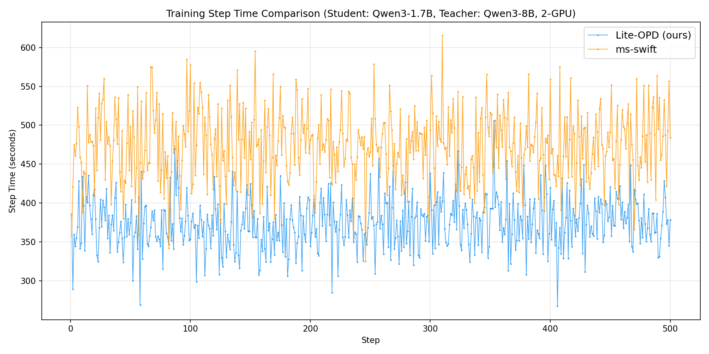
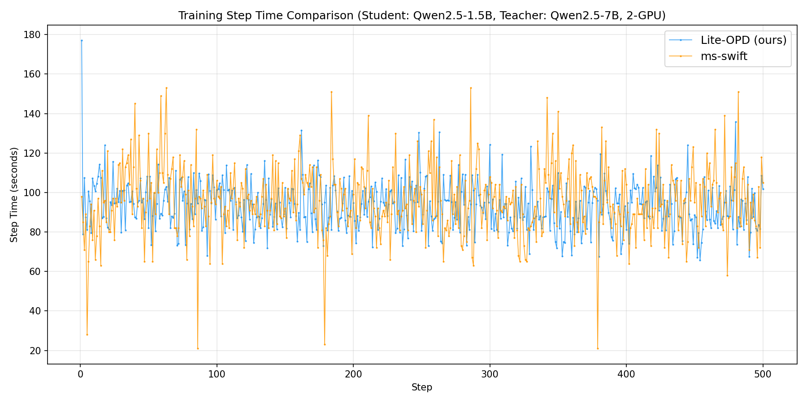

# Lite-OPD: On-Policy Distillation

[English](README.md) | [Chinese](README_zh.md)

Lite-OPD is an on-policy distillation training framework designed for research. The student model generates rollouts in real time, the teacher model scores them, and the student learns the teacher's distribution via KL divergence loss.

Supported models: Qwen2.5 / Qwen3 / Llama 3.x / Gemma 3

Supported losses: forward KL / reverse KL / JSD (full vocabulary, not approximated)

## Design Philosophy

Lite-OPD targets research workflows that require deep customization of the training loop. The framework prioritizes **modifiability** and **maintainability** over feature completeness.

Core design choices:

- **Single-process synchronous architecture**: Training and inference run in the same process with zero-copy weight sharing, eliminating communication overhead. No multi-worker coordination, no cross-node scheduling, no async state synchronization.
- **Minimal abstraction**: No callback system, no plugin mechanism, no multi-layer configuration abstraction. The core training logic lives in a single file. To modify behavior, you edit the code directly — no need to understand framework extension points.
- **Low hardware barrier**: A single GPU can run the full on-policy distillation loop (rollout → teacher scoring → student backward), suitable for resource-constrained lab environments.

## Code Scale

The entire framework is ~9000 lines of Python and ~2100 lines of C/CUDA kernels.

```
src/liteopd/
├── data/       Data loading
├── eval/       Evaluation scoring
├── losses/     Distillation losses (forward KL / reverse KL / JSD)
├── train/      Training loop, ZeRO-2, sequence packing
├── runtime/    Inference engine lifecycle management
└── inference/  Embedded inference engine
```

## Training Flow

```
┌─────────────────────────────────────────────────────────────────┐
│                        Training Loop                             │
│                                                                 │
│  1. Rollout (embedded inference engine)                         │
│     - Student generates N responses                             │
│     - Inference engine shares weights with training (zero-copy) │
│                                                                 │
│  2. Teacher Forward                                             │
│     - Teacher computes logits over student responses            │
│     - Sequence packing + torch.compile acceleration             │
│                                                                 │
│  3. Loss + Backward (two-stage chunk)                           │
│     - Compute KL loss gradient w.r.t. hidden per chunk          │
│     - Backpropagate gradients through student backbone at once  │
│     - Peak memory = O(chunk_size), not O(total_response_tokens) │
│                                                                 │
│  4. Optimizer Step                                              │
│     - Weight updates are instantly visible to inference engine  │
│       (shared memory)                                           │
│                                                                 │
│  5. Repeat                                                      │
└─────────────────────────────────────────────────────────────────┘
```

## Performance Comparison

2× H20 96GB, `global_batch_size=128`, `reverse_kl`, 500 steps. Both frameworks use essentially the same training configuration — see [benchmarks/ms-swift/](benchmarks/ms-swift/) for details.

<table>
<tr>
<td></td>
<td></td>
</tr>
<tr>
<td align="center">Qwen3-1.7B → Qwen3-8B<br/>Lite-OPD ~374s/step vs ms-swift ~474s/step</td>
<td align="center">Qwen2.5-1.5B → Qwen2.5-7B<br/>Lite-OPD ~93s/step vs ms-swift ~96s/step</td>
</tr>
</table>

## Acceleration Techniques

See [docs/acceleration_techniques.md](docs/acceleration_techniques.md) for details.

**Lite-OPD-specific techniques:**

| Technique | Benefit |
|-----------|---------|
| Zero-copy weight sharing | Eliminates weight sync overhead + saves one copy of model memory |
| Two-stage chunk backward | Full-vocab KL with ~8x reduction in logits peak memory |
| ZeRO-2 gradient buffer dynamic release | ~3GB/GPU freed for KV cache during rollout |
| Shortest-first scheduling | ~10% reduction in batch makespan |
| VMM KV cache release | Frees all KV cache memory during training |
| Teacher compile + bucket packing | Bounds compilation count, prevents memory growth |

**Standard techniques:** Prefix cache (radix tree), Chunked prefill, Paged attention, CUDA graph, FlashInfer / sgl_kernel, ZeRO-2 data parallelism, Sequence packing

## Quick Start

### Requirements

- Python 3.10+
- PyTorch 2.4+
- CUDA 12.1+

### Installation

```bash
pip install -e .
```

### Training

```bash
# Single GPU
CUDA_VISIBLE_DEVICES=0 NPROC_PER_NODE=1 bash scripts/train.sh configs/qwen25_1b5_7b.yaml

# Multi-GPU (ZeRO-2)
CUDA_VISIBLE_DEVICES=0,1 NPROC_PER_NODE=2 bash scripts/train.sh configs/qwen25_1b5_7b.yaml
```

### Configuration

See [configs/README.md](configs/README.md) for all configuration parameters.

Example configs using bundled sample datasets are provided for quick validation:

```bash
CUDA_VISIBLE_DEVICES=0 NPROC_PER_NODE=1 bash scripts/train.sh configs/example_qwen25_1b5_7b.yaml
```

## Documentation

- [Configuration Reference](configs/README.md)
- [Acceleration Techniques](docs/acceleration_techniques.md)
- [Code Architecture](docs/architecture.md)

## Acknowledgements

Lite-OPD's inference engine is built upon ideas and code from the following open-source projects:

- [SGLang](https://github.com/sgl-project/sglang) — High-performance LLM serving framework.
- [mini-sglang](https://github.com/EvolvingLMMs-Lab/mini-sglang) — A minimal reimplementation of SGLang's core inference loop.
- [FlashInfer](https://github.com/flashinfer-ai/flashinfer) — High-performance kernels.
